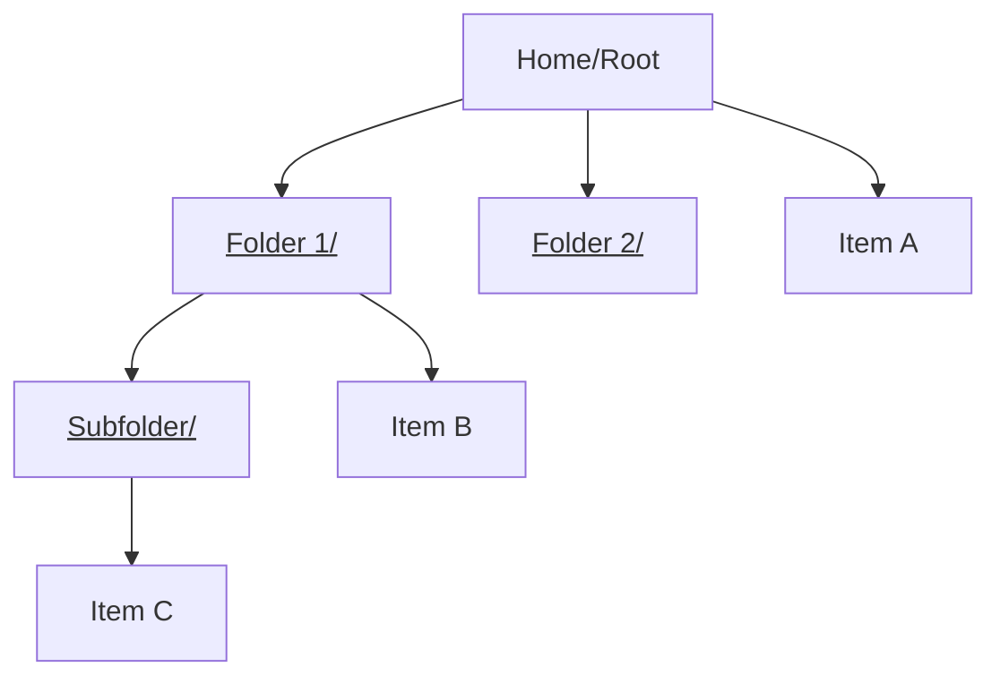
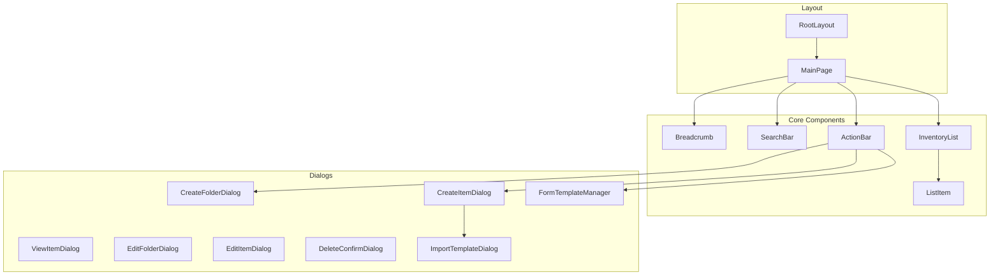

# DoWeHaveIt - Frontend Implementation Plan

A household inventory management system with hierarchical folder/item structure and user-defined dynamic forms.

---

## Tech Stack

| Layer | Technology |
|-------|------------|
| Framework | Next.js 16 (App Router) |
| UI Library | MUI (Material UI) - mat-card style |
| State Management | Zustand |
| Styling | Tailwind CSS v4 + MUI theming |
| Language | TypeScript |
| Icons | MUI Icons |

---

## Core Features Overview



### Navigation
- Breadcrumb trail: `Home > Kitchen > Appliances`
- Click folder to drill down, click breadcrumb to navigate back

### List View Features
- **Search bar** at top with text input + search icon (Enter key or click triggers search)
- Search matches both attribute names and values
- **Folder display**: Name with `/` suffix and underline
- **Item display**: Name only
- **Sorting**: 
  - Folders always appear above items
  - Within each section, items are sorted **alphabetically by name**

### Row Actions (Right side)
| Icon | Action | Applies To |
|------|--------|------------|
| 👁️ View | Opens view dialog | Items only |
| ✏️ Edit | Opens edit dialog | Folders & Items |
| 🗑️ Delete | Confirmation dialog → Delete | Folders & Items |

> [!NOTE]
> Items can be viewed by clicking the row OR clicking the view icon. The view icon provides a consistent action pattern across the UI.

### Bottom Action Bar
| Position | Icon | Action |
|----------|------|--------|
| Left | + Folder | Create new folder |
| Center | + Item | Create new item with form |
| Right | 📋 Templates | Manage form templates |

---

## Data Models

### TypeScript Interfaces

```typescript
// Core entities
interface Folder {
  id: string;
  name: string;
  parentId: string | null; // null = root level
  createdAt: string;
  updatedAt: string;
}

interface Item {
  id: string;
  name: string;
  comments: string;
  parentId: string | null; // folder ID or null for root
  attributes: ItemAttribute[];
  createdAt: string;
  updatedAt: string;
}

interface ItemAttribute {
  fieldId: string;
  fieldName: string;
  value: string;
}

// Form template system
interface FormTemplate {
  id: string;
  name: string;
  fields: FormField[];
  createdAt: string;
}

interface FormField {
  id: string;
  name: string;
  type: 'text'; // Text input only for simplicity
  required: boolean;
}

// Navigation state
interface BreadcrumbItem {
  id: string | null; // null for root
  name: string;
}
```

---

## Component Architecture



---

## Proposed Changes

### Dependencies to Install

```bash
npm install zustand @mui/material @mui/icons-material @emotion/react @emotion/styled
```

---

### [NEW] Store Layer - Zustand State Management

#### [NEW] [inventoryStore.ts](file:///c:/Users/Lee58/PhpstormProjects/do-we-have-it/store/inventoryStore.ts)
Central state management for folders and items:
- Current folder path/ID
- Breadcrumb trail
- Folders and items in current view
- CRUD operations (will call mock API)

#### [NEW] [formTemplateStore.ts](file:///c:/Users/Lee58/PhpstormProjects/do-we-have-it/store/formTemplateStore.ts)
State management for user's form templates:
- List of saved templates
- Selected template for item creation
- CRUD operations for templates

#### [NEW] [searchStore.ts](file:///c:/Users/Lee58/PhpstormProjects/do-we-have-it/store/searchStore.ts)
Search functionality state:
- Search query
- Search results
- Search loading state

---

### [NEW] API Layer - Mock Backend Services

#### [NEW] [api/inventory.ts](file:///c:/Users/Lee58/PhpstormProjects/do-we-have-it/lib/api/inventory.ts)
Mock API functions for inventory operations:
- `getFolderContents(parentId)` - List folders/items
- `createFolder(name, parentId)` - Create folder
- `updateFolder(id, name)` - Rename folder
- `deleteFolder(id)` - Delete folder
- `createItem(data, parentId)` - Create item
- `getItem(id)` - Get item details
- `updateItem(id, data)` - Update item
- `deleteItem(id)` - Delete item
- `searchItems(query, parentId)` - Search by name/value

#### [NEW] [api/formTemplates.ts](file:///c:/Users/Lee58/PhpstormProjects/do-we-have-it/lib/api/formTemplates.ts)
Mock API for form template management:
- `getTemplates()` - List user's templates
- `createTemplate(template)` - Save new template
- `deleteTemplate(id)` - Delete template
- `importTemplate(id)` - Import template for use

---

### [NEW] UI Components

#### [NEW] [Breadcrumb.tsx](file:///c:/Users/Lee58/PhpstormProjects/do-we-have-it/components/Breadcrumb.tsx)
- Displays path like `Home > Kitchen > Appliances`
- Each segment is clickable for navigation
- Home is always first

#### [NEW] [SearchBar.tsx](file:///c:/Users/Lee58/PhpstormProjects/do-we-have-it/components/SearchBar.tsx)
- Text input with search icon on right
- Enter key triggers search
- Click on search icon triggers search
- Clears when navigating folders

#### [NEW] [InventoryList.tsx](file:///c:/Users/Lee58/PhpstormProjects/do-we-have-it/components/InventoryList.tsx)
- Container for folder/item list
- Handles empty state
- Renders folders first, then items

#### [NEW] [FolderRow.tsx](file:///c:/Users/Lee58/PhpstormProjects/do-we-have-it/components/FolderRow.tsx)
- Uses MUI Card with mat-card styling (elevation, rounded corners)
- Displays folder name with `/` suffix
- Underline styling
- Click navigates into folder
- Edit + Delete icons on right

#### [NEW] [ItemRow.tsx](file:///c:/Users/Lee58/PhpstormProjects/do-we-have-it/components/ItemRow.tsx)
- Uses MUI Card with mat-card styling
- Displays item name (no decoration)
- Click opens view dialog
- View + Edit + Delete icons on right

#### [NEW] [ActionBar.tsx](file:///c:/Users/Lee58/PhpstormProjects/do-we-have-it/components/ActionBar.tsx)
- Fixed at bottom of list view
- Three buttons: + Folder | + Item | Templates
- Triggers respective dialogs

---

### [NEW] Dialog Components

#### [NEW] [CreateFolderDialog.tsx](file:///c:/Users/Lee58/PhpstormProjects/do-we-have-it/components/dialogs/CreateFolderDialog.tsx)
- Simple form with folder name input
- Validates uniqueness in current layer
- Create/Cancel buttons

#### [NEW] [CreateItemDialog.tsx](file:///c:/Users/Lee58/PhpstormProjects/do-we-have-it/components/dialogs/CreateItemDialog.tsx)
- Form with mandatory: Name, Comments
- Dynamic fields from selected template (if any)
- Import icon (top-right) opens template selector
- Create/Cancel buttons

#### [NEW] [ViewItemDialog.tsx](file:///c:/Users/Lee58/PhpstormProjects/do-we-have-it/components/dialogs/ViewItemDialog.tsx)
- Read-only display of item details
- Shows all attributes (name: value pairs)
- Close button

#### [NEW] [EditFolderDialog.tsx](file:///c:/Users/Lee58/PhpstormProjects/do-we-have-it/components/dialogs/EditFolderDialog.tsx)
- Edit folder name
- Validates uniqueness
- Save/Cancel buttons

#### [NEW] [EditItemDialog.tsx](file:///c:/Users/Lee58/PhpstormProjects/do-we-have-it/components/dialogs/EditItemDialog.tsx)
- Edit all item fields
- Same form structure as create
- Save/Cancel buttons

#### [NEW] [DeleteConfirmDialog.tsx](file:///c:/Users/Lee58/PhpstormProjects/do-we-have-it/components/dialogs/DeleteConfirmDialog.tsx)
- Generic confirmation dialog
- "Are you sure?" message
- Confirm/Cancel buttons

#### [NEW] [FormTemplateManager.tsx](file:///c:/Users/Lee58/PhpstormProjects/do-we-have-it/components/dialogs/FormTemplateManager.tsx)
Dialog for managing user's form templates:
- **List view**: Displays all saved form templates in a list
- **Row actions**: Each template row has:
  - 👁️ View icon - Opens ViewFormTemplateDialog (read-only)
  - ✏️ Edit icon - Opens EditFormTemplateDialog
  - 🗑️ Delete icon - Opens DeleteConfirmDialog
- **Create button**: At bottom, opens CreateFormTemplateDialog
- Reuses same row action pattern as FolderRow/ItemRow for consistency

#### [NEW] [CreateFormTemplateDialog.tsx](file:///c:/Users/Lee58/PhpstormProjects/do-we-have-it/components/dialogs/CreateFormTemplateDialog.tsx)
- Form with template name input
- Dynamic field builder (add/remove text fields)
- Each field: name + required checkbox
- Save/Cancel buttons

#### [NEW] [ViewFormTemplateDialog.tsx](file:///c:/Users/Lee58/PhpstormProjects/do-we-have-it/components/dialogs/ViewFormTemplateDialog.tsx)
- Read-only display of template structure
- Shows template name and all defined fields
- Close button

#### [NEW] [EditFormTemplateDialog.tsx](file:///c:/Users/Lee58/PhpstormProjects/do-we-have-it/components/dialogs/EditFormTemplateDialog.tsx)
- Same layout as CreateFormTemplateDialog
- Pre-populated with existing template data
- Save/Cancel buttons

#### [NEW] [ImportTemplateDialog.tsx](file:///c:/Users/Lee58/PhpstormProjects/do-we-have-it/components/dialogs/ImportTemplateDialog.tsx)
- List of available templates
- Select to apply to current item form
- Cancel button

---

### [NEW] MUI Theme & Shared Components

#### [NEW] [theme.ts](file:///c:/Users/Lee58/PhpstormProjects/do-we-have-it/lib/theme.ts)
- Custom MUI theme configuration
- Mat-card style aesthetics (elevated cards, rounded corners)
- Consistent color palette
- Typography settings

#### [NEW] [ThemeProvider.tsx](file:///c:/Users/Lee58/PhpstormProjects/do-we-have-it/components/ThemeProvider.tsx)
- Client component wrapper for MUI ThemeProvider
- Handles SSR compatibility with Next.js

#### UI Components (Using MUI + Tailwind CSS mat-card style)
We will follow the mat-card pattern from `todo-list` project (`globals.css`):

```css
.mat-card {
  @apply max-w-xl mx-auto mt-10 rounded-xl bg-white dark:bg-gray-800
  pt-4 pb-8 px-8 shadow-lg ring-1 ring-gray-900/5;
}
```

MUI components used:
- `Dialog` - Modal dialogs
- `Button` - Action buttons  
- `TextField` - Text inputs
- `IconButton` - Icon action buttons
- `Breadcrumbs` - Navigation breadcrumbs

---

### [MODIFY] [page.tsx](file:///c:/Users/Lee58/PhpstormProjects/do-we-have-it/app/page.tsx)
Replace boilerplate with main inventory view:
- Breadcrumb at top
- SearchBar below breadcrumb
- InventoryList in main area
- ActionBar at bottom

### [MODIFY] [layout.tsx](file:///c:/Users/Lee58/PhpstormProjects/do-we-have-it/app/layout.tsx)
- Update metadata (title, description)
- Add Zustand provider if needed

### [MODIFY] [globals.css](file:///c:/Users/Lee58/PhpstormProjects/do-we-have-it/app/globals.css)
- Add any custom CSS variables
- Dialog overlay styles

---

## File Structure After Implementation

```
do-we-have-it/
├── app/
│   ├── page.tsx
│   ├── layout.tsx
│   └── globals.css           # mat-card + dialog CSS classes
├── components/
│   ├── shared/
│   │   ├── ThemeProvider.tsx
│   │   └── DeleteConfirmDialog.tsx
│   ├── Breadcrumb/
│   │   └── Breadcrumb.tsx
│   ├── SearchBar/
│   │   └── SearchBar.tsx
│   ├── InventoryList/
│   │   ├── InventoryList.tsx
│   │   ├── FolderRow/
│   │   │   └── FolderRow.tsx
│   │   └── ItemRow/
│   │       └── ItemRow.tsx
│   ├── ActionBar/
│   │   ├── ActionBar.tsx
│   │   ├── CreateFolderDialog/
│   │   │   └── CreateFolderDialog.tsx
│   │   └── CreateItemDialog/
│   │       ├── CreateItemDialog.tsx
│   │       └── ImportTemplateDialog.tsx
│   ├── ItemDialogs/
│   │   ├── ViewItemDialog.tsx
│   │   └── EditItemDialog.tsx
│   ├── FolderDialogs/
│   │   └── EditFolderDialog/
│   │       └── EditFolderDialog.tsx
│   └── FormTemplateManager/
│       ├── FormTemplateManager.tsx
│       ├── CreateFormTemplateDialog/
│       │   └── CreateFormTemplateDialog.tsx
│       ├── ViewFormTemplateDialog/
│       │   └── ViewFormTemplateDialog.tsx
│       └── EditFormTemplateDialog/
│           └── EditFormTemplateDialog.tsx
├── store/
│   ├── inventoryStore.ts
│   ├── formTemplateStore.ts
│   └── searchStore.ts
├── api/
│   ├── inventory.ts
│   └── formTemplates.ts
├── lib/
│   └── theme.ts
└── types/
    └── index.ts
```

---

## Implementation Order

1. **Phase 1: Foundation**
   - [ ] Install dependencies (zustand, @mui/material, @emotion/react, @emotion/styled)
   - [ ] Create TypeScript types
   - [ ] Set up MUI theme with mat-card styling
   - [ ] Set up Zustand stores
   - [ ] Create mock API layer

2. **Phase 2: Core UI with MUI**
   - [ ] Set up ThemeProvider wrapper for Next.js SSR
   - [ ] Build Breadcrumb component (using MUI Breadcrumbs)
   - [ ] Build SearchBar component (using MUI TextField + IconButton)
   - [ ] Build InventoryList, FolderRow, ItemRow (using MUI Card)
   - [ ] Build ActionBar (using MUI Button)

3. **Phase 3: Folder/Item Dialogs**
   - [ ] CreateFolderDialog
   - [ ] CreateItemDialog
   - [ ] ViewItemDialog
   - [ ] EditFolderDialog + EditItemDialog
   - [ ] DeleteConfirmDialog

4. **Phase 4: Form Template Management**
   - [ ] FormTemplateManager dialog
   - [ ] CreateFormTemplateDialog
   - [ ] ViewFormTemplateDialog
   - [ ] EditFormTemplateDialog
   - [ ] ImportTemplateDialog
   - [ ] Integrate with CreateItemDialog

5. **Phase 5: Integration & Polish**
   - [ ] Wire up main page
   - [ ] Connect all components
   - [ ] Test full flows
   - [ ] Responsive design verification

---

## Verification Plan

### Manual Testing
1. **Navigation**: Create nested folders, verify breadcrumb updates correctly
2. **CRUD Operations**: Create/edit/delete folders and items
3. **Uniqueness**: Verify folder names must be unique per layer
4. **Search**: Test searching by item name and attribute values
5. **Form Templates**: Create template, import into item creation, delete template
6. **Dialogs**: All dialogs open/close correctly, handle cancel

### Browser Testing
- Test responsive layout
- Verify keyboard navigation (Enter to search, Escape to close dialogs)
- Check dark mode compatibility

---

## UI Wireframe

```
┌─────────────────────────────────────────────────────┐
│  Home > Kitchen > Appliances                        │  ← Breadcrumb
├─────────────────────────────────────────────────────┤
│  🔍 [Search items and folders...        ] [🔎]     │  ← Search Bar
├─────────────────────────────────────────────────────┤
│  ┌─────────────────────────────────────────────┐    │
│  │ 📁 Large Appliances/              [✏️][🗑️] │    │  ← Folders (A-Z)
│  └─────────────────────────────────────────────┘    │
│  ┌─────────────────────────────────────────────┐    │
│  │ 📁 Small Appliances/              [✏️][🗑️] │    │
│  └─────────────────────────────────────────────┘    │
│  ┌─────────────────────────────────────────────┐    │
│  │ Blender                      [👁️][✏️][🗑️] │    │  ← Items (A-Z)
│  └─────────────────────────────────────────────┘    │
│  ┌─────────────────────────────────────────────┐    │
│  │ Coffee Maker                 [👁️][✏️][🗑️] │    │
│  └─────────────────────────────────────────────┘    │
│  ┌─────────────────────────────────────────────┐    │
│  │ Toaster                      [👁️][✏️][🗑️] │    │
│  └─────────────────────────────────────────────┘    │
│                                                     │
├─────────────────────────────────────────────────────┤
│     [+ Folder]      [+ Item]       [📋 Templates]   │  ← Action Bar
└─────────────────────────────────────────────────────┘
```

---

> [!NOTE]
> This plan focuses on **frontend only**. All API calls are mocked and will need to be connected to a real backend later. The mock layer is designed with the same interface the real backend will use.
